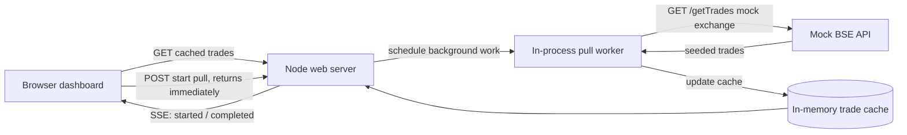

# TradeDesk: asynchronous BSE trades dashboard

A dependency-free Node.js demo of a dashboard that serves cached trades immediately and updates open browsers when a background pull completes.

## Requirements

- Node.js 20 or newer
- No package installation required

## Run locally

```sh
npm start
```

Open [http://localhost:3000](http://localhost:3000). The dashboard starts with 2,400 seeded records. Choose **Pull latest trades** to start a background pull; after the configured delay, 24 new records appear automatically in every open dashboard.

Set the simulated pull duration (0–900,000 ms / 15 minutes) with `PULL_DELAY_MS`:

```powershell
$env:PULL_DELAY_MS = '15000'
npm start
```

```sh
PULL_DELAY_MS=15000 npm start
```

## API

| Method and route | Purpose |
| --- | --- |
| `GET /getTrades` | Mock BSE API. Returns a seeded batch immediately. |
| `GET /api/trades` | Returns the current cached records, pull state, and last completion. Fast response for page load. |
| `POST /api/pull` | Starts a background pull and returns its job immediately. Optional JSON body: `{"delayMs": 15000}`. |
| `GET /api/events` | Server-Sent Events stream for pull start and completion notifications. |

The in-memory store resets when the process restarts. This keeps the example easy to run; a production service would persist trades and job state in a database and run workers independently of web instances.

## Architecture



### Why this design

The dashboard never waits for a full exchange pull: it reads the local cache on page load, so existing trades render immediately. Starting a pull is a short request that returns a job ID; the work continues after that request closes. Open dashboards subscribe to one Server-Sent Events connection, and the server pushes the new records when the pull finishes. There is no browser polling loop, cron job, or long-lived HTTP request for the pull itself. SSE is a good fit because updates travel from server to browser in one direction.

The simulated pull duration is configurable up to 15 minutes, but the mock exchange call itself remains fast. This mirrors the 30-second network limit: the browser's start request returns immediately, the worker waits independently, then fetches `/getTrades` over a short request. A real exchange integration should use its asynchronous job or cursor-based API, keep each exchange HTTP call within its 30-second limit, and persist job state so work survives process restarts.

## Video walkthrough

Suggested 60-second recording: open the dashboard and point out the seeded trades and total; click **Pull latest trades**; show that the table stays usable while the status timer runs; then show the new rows appearing without refresh when the pull completes. To make the wait shorter, run with `PULL_DELAY_MS=5000`. Mention that the page uses SSE and the pull start endpoint returns immediately.
# trade-dashboard
